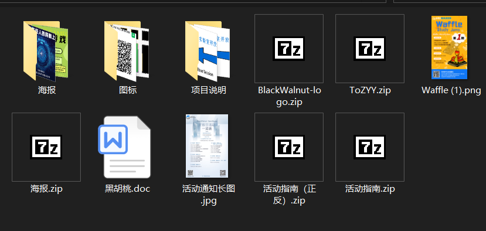
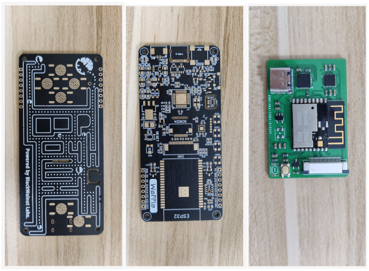
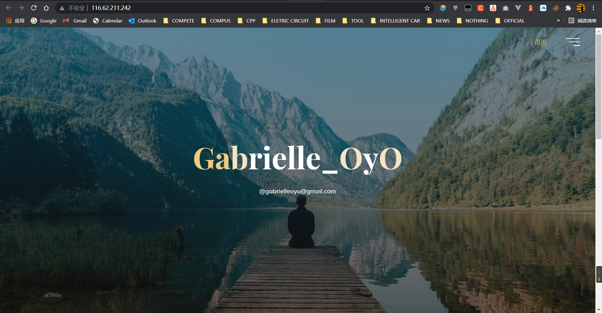
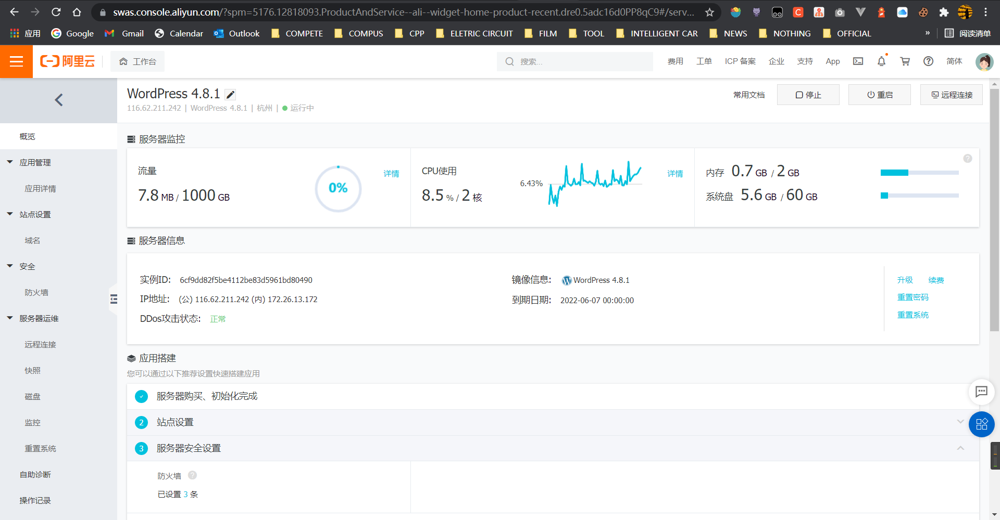

# Learning-Repo

姓名：曾瑶瑶
年级：大三
加入时间：2019年10月
学习方向：UI设计---前端开发
在按要求完成基础课程的前提下进行的相关本专业的课外自主学习和拓展。

**学习情况（按照时间线）**

---

大一上：完成实验室UI基础学些，掌握Xmind、摹课、墨刀、PS、AE、XD等工具的基础使用，能够独立完成一个原型作品，高保真度还有待提升，项目经验不足。

----

---

大一下：（疫情家里蹲）开启了经营自己的博客之路。

CSDN（国内最大技术交流平台）：https://blog.csdn.net/Gabrielle_OyO
截至目前(2021/10/18)平台累计被访问量152,482人次，已整理发布原创文章197篇，站内记者排名第8756名，粉丝量219人。

Github（全球技术交流平台）：https://github.com/Gabrielle-OyO
内存我的所有项目工程以及学习资料，公开和私有的仓库包括数据结构、嵌入式学习、树莓派、esp32小开发、阿里云服务器项目、HarmonyOS开发、前端开发、人工智能（机器学习、深度学习）部分方向的学习资料和练手项目源代码。

---

大二上：

①加入黑胡桃实验室，帮助老师开设面向全校开设的python公选课学习课程，同时会有面向全国的线上直播公开课，进行demo演示和讲解，提供编程学习教育和课程资料，为编程爱好者解疑答惑。
②负责2020年度黑胡桃实验室BlackWalnut和UBIMAKER社团的招新，包括活动策划、项目策划、宣讲主持、海报、地通展板、易拉宝设计等。巩固了PS、AE工具的使用。
③小demo基于esp32的天气预报系统。
④参与实验室和华为合作的基于鸿蒙操作系统OpenHarmony的编程教育产品开发，项目中负责产品外观设计、基于海思芯片3861进行模块功能拓展，涉及到PCB设计、电路设计、焊接、测试全过程，后期负责底层系统测试和复现。

---

大二下：这学期比较丧，心态变了许多，感觉人生没啥意思，浑浑噩噩、混混水水
①进行前端学习，从html、css、js到node.js、jQuery基础使用，框架学习vue.js，掌握了基本的界面设计搭建、基础事件、指令、周期等。
②暑期在西安四维图新信息技术有限公司进行实习，参与《人工智能大数据挖掘》项目中的矢量标注项目，工期20日，工资8456人名币。
③进行暑期短学期实践课程时，闲着无聊，买了个阿里云服务器，搭建了个小网站。

---

----

大三上：
	①踏入人工智能的大门，完成了胡浩基老师的《机器学习》课程。
	②进行项目实战，复现了基于tensorflow关于Keras基础应用的MNIST手写数字图像识别小demo，撰写了相关资料
		教程：https://blog.csdn.net/Gabrielle_OyO/article/details/120230270?spm=1001.2014.3001.5502  
		源代码：https://github.com/Gabrielle-OyO/Tensorflow/tree/main/01-Keras%E5%9F%BA%E7%A1%80%E5%BA%94%E7%94%A8%EF%BC%88MNIST%E6%89%8B%E5%86%99%E6%95%B0%E5%AD%97%E5%9B%BE%E5%83%8F%E8%AF%86%E5%88%AB%EF%BC%89
	③闲着无聊做了份简历投了出去，海投，还挺好玩的。看了别人的充分的意识到自己菜鸡有多菜鸡了，决定收收心，好好考读书。想读书。
.png)

---

**接下来的规划**
---

大目标：
	①准备2023年度考研
	②发表一篇论文（关于深度学习或机器学习）
	③准备一个DEMO作为毕设

小目标：
	①完成论文翻译
	②完成论文复现
	③12月考六级
	④刷完数据结构LeetCode
	⑤刷完《图解网络》
	⑥微积分前半部分基础过一遍
	⑦完成基础课程任务

**碎碎念**
---

最近有好多琐碎的事情啊，做的不认真、学的不专心、玩得不尽兴，心情也开始容易被别人印象到了，希望能尽快找到状态。

